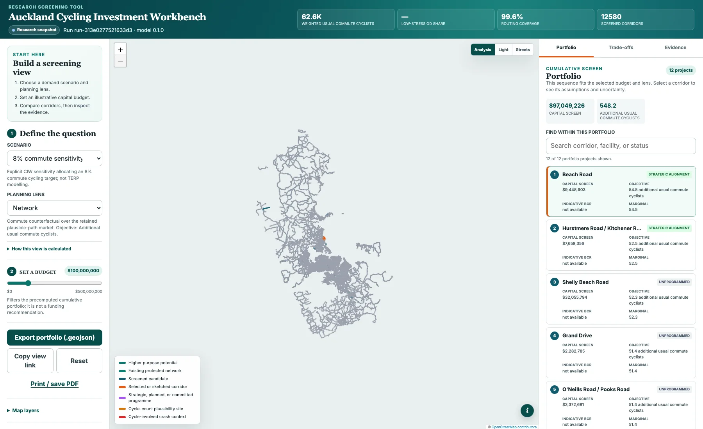

# SPAN: Spending Priorities for Active Networks

Where might a new cycling connection make the biggest difference, and in what
order should the connections be built?

SPAN is an open research tool from the
[Better Places Lab](https://betterplaces.blogs.auckland.ac.nz) for exploring
that question in Auckland. It brings demand scenarios, street-network
conditions, candidate routes and project sequencing into one interactive map.
It was first released in 2026 as the Auckland Cycling Investment Workbench
(CIW); the command-line tool and Python package keep the `ciw` name.

[Open SPAN](https://span.tfwelch.com)
· [Download v1.0.0](https://github.com/squirmen/auckland-cycling-investment-workbench/releases/tag/v1.0.0)
· [Read the method](documentation/methodology/methodology.md)



## What you can do

- Compare PCT cycling scenarios, including a separate 8% commute sensitivity.
- Explore candidate links by likely demand, network contribution and purpose.
- Build a portfolio to a chosen budget and see how each addition changes the
  result.
- Compare Network, School, Everyday, Transit, Equity and Appraisal views when
  the required evidence is available.
- Compare candidates with Future Connect and RLTP context, July 2026 cycle
  counter sites, major scheduled transit nodes and a disclosure-safe road-safety
  layer.
- Inspect the route and evidence behind a candidate rather than relying on a
  single composite score.
- Sketch a corridor on the routable graph and export the current selection as
  GeoJSON.
- Switch between a clean analysis view and light or street basemaps without
  changing the model results.
- Use the map on a desktop, tablet or phone, with keyboard-accessible controls.

The current Auckland snapshot contains 12,580 candidate links derived from
780,429 disaggregated trip-purpose records. Of the 42,708 records selected for
routing, 42,551 were routed successfully. These numbers describe the scope of
the run, not the accuracy of its forecasts.

## How it works

SPAN has one map workspace: **Build order**, **Value for money** and
**Connected journeys**. Link details explain the treatment and connections first;
journey equivalents, sampling diagnostics and sensitivity sit behind expandable
method notes. Connected journeys currently covers a local 4 km-radius sample, not
a citywide or calibrated forecast. Old `research.html` links redirect into SPAN.
See the
[results, limitations and reproduction commands](documentation/research/span-access-first-experiment.md).

The [17 September methodology review](documentation/research/methodology-review-2026-09.md)
records the expanded 169-OD experiment, preference-aware routing, conserved
assignment and the limits of any novelty or planning-readiness claim. Connected
journeys exports GIS packages with the selected route and funding status.

The [effective-network beta](documentation/research/span-effective-network.md)
adds an AT intersection inventory overlay and tests assumed waits on SPAN's
native directed junctions in the research pilot. Unresolved matches are held
out; actual signal timing still needs AT evidence. This does not change the
main explorer's investment rankings.

## Where CRANC fits

CRANC belongs after selection of a complete investment package, as a future
**Access to destinations** result within SPAN. **There is no live integration or
public CRANC panel.** The versioned request, comparison and scope validators in
`web/src/cranc.ts` remain tested building blocks. The execution adapter, paired
scenario graphs and fuller routing-scope contract still need implementation.
Accessibility gains must remain separate from estimates of additional cycling.

See the [exact code entry points and adapter checklist](documentation/research/cranc-integration.md#where-to-connect-cranc)
and the [prioritised improvement review](documentation/audit/span-improvement-review-2026-09-24.md).
Collaborator source archives, source runs and deployment bundles are not committed.

## Model foundations

The analysis starts with census journey-to-work data and a cycling network built
from OpenStreetMap node and way identities. It keeps direction, access,
bridge, tunnel and layer information so that roads crossing at different
levels do not become false junctions.

Demand is assigned across plausible paths rather than a single shortest path.
Candidate projects are made from exact graph edges, then tested against the OD
markets that could use them. Portfolios are presented as trade-offs and named
planning views; the tool does not hide those choices inside a master score.

The methodology, equations and assumptions are documented in
[`documentation/methodology`](documentation/methodology) and
[`documentation/equations`](documentation/equations). The full OD/path ledger,
failure records, source inventory, parameters and checksums are retained with
each run.

## Try it locally

The small demonstration dataset is included in the repository. It exercises
the complete raw-to-web workflow without requiring the Auckland source files.
You will need Python 3.11, [`uv`](https://docs.astral.sh/uv/) and Node.js 24.

```sh
uv sync --locked --all-extras
uv run ciw demo --export-web
npm --prefix web ci
npm --prefix web run build
```

To run the checks used for a release:

```sh
uv run pytest
npm --prefix web test
npm --prefix web run lint
npm --prefix web run typecheck
```

The repository also includes a pinned Docker build for an isolated environment:

```sh
docker build --tag auckland-cycling-investment-workbench:local .
docker run --rm auckland-cycling-investment-workbench:local --help
```

## Run an Auckland build

Raw and licensed data stay outside the repository under a data root chosen by
the user. [`DATA_SOURCES.md`](DATA_SOURCES.md) lists the required files and
[`DATA_LICENSES.md`](DATA_LICENSES.md) records what may be redistributed.

```sh
uv run ciw data fetch --config configs/auckland.yml --data-root /path/to/ciw-data
uv run ciw run --config configs/auckland.yml --data-root /path/to/ciw-data
uv run ciw validate --config configs/auckland.yml --data-root /path/to/ciw-data --run <run-id>
uv run ciw export-web --config configs/auckland.yml --data-root /path/to/ciw-data --run <run-id>
```

Each run writes a manifest with its inputs, versions, random seeds, stage
fingerprints, timings, row counts, failures and output hashes. Interrupted
stages can be resumed without rerunning unaffected work.

To add SPAN's existing-network context, physical groups and deduplicated commute
route use to a completed Auckland run without changing that run:

```sh
uv run python scripts/build_span_context.py --run runs/<run-id> --output web/public/data
npm --prefix web run dev
```

All source artifacts must be available locally. The enriched export is staged
and checked before replacing browser data. See the
[network and demand review](documentation/audit/span-network-and-demand-review.md)
for the implemented measures and remaining model questions.

## Reading the results

SPAN is intended for research and early option development. It is not a list
of approved projects and it is not a substitute for consultation, site work,
detailed design, a safety audit or a business case.

A few current limitations matter in particular:

- The 8% commute share is a modelling sensitivity, not an Auckland Transport
  target or a restatement of TERP.
- The current Auckland snapshot exposes an indicative, research-only appraisal
  and an NZDep high-deprivation-origin view. Neither is a business-case result
  or a causal equity estimate.
- Auckland cycle counters provide a spatial plausibility check using
  project-maintained approximate site locations. They are not like-for-like
  predictive validation of census commute demand and cannot support directional
  or screenline comparisons.
- The safety overlay contains suppressed 500 m counts of police-reported,
  cycle-involved crashes. It is not adjusted for cycling exposure.
- Full-network low-stress connectivity is intentionally not reported in this
  release. It is reserved for integration with Steve Gehrke's sabbatical
  research.
- Portfolio views show useful trade-offs, but they do not prove a globally
  optimal investment programme.

The detailed limitations and validation record are in
[`documentation/methodology/limitations.md`](documentation/methodology/limitations.md)
and [`documentation/methodology/validation.md`](documentation/methodology/validation.md).

## Release and citation

The source code is released under the [MIT License](LICENSE). Data and
publication rights remain with their providers; see [`NOTICE.md`](NOTICE.md)
and [`DATA_LICENSES.md`](DATA_LICENSES.md).

If you use SPAN in research, cite the software using
[`CITATION.cff`](CITATION.cff) and cite the underlying methods and datasets
relevant to your analysis. Version 1.0.0 was released as the Auckland Cycling
Investment Workbench.
