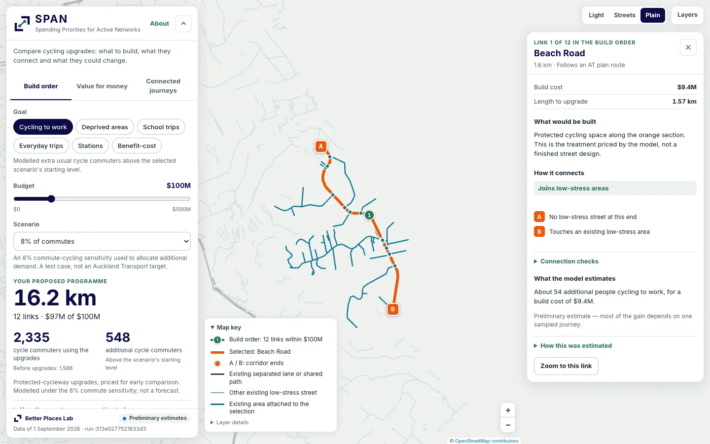

# SPAN: Spending Priorities for Active Networks

SPAN ranks possible new cycling links in Auckland and puts them in a build order
for a chosen goal and budget. It is an open research tool from the
[Better Places Lab](https://betterplaces.blogs.auckland.ac.nz) that shows demand
scenarios, street-network conditions, candidate routes and project sequencing on
one interactive map.

SPAN was first released in 2026 as the Auckland Cycling Investment Workbench
(CIW). The command-line tool and Python package keep the `ciw` name.

[Open SPAN](https://span.tfwelch.com)
· [Download v2.0.1](https://github.com/squirmen/spending-priorities-active-networks/releases/tag/v2.0.1)
· [Read the method](documentation/methodology/methodology.md)



## What you can do

- Compare PCT cycling scenarios, including a separate 8% commute sensitivity.
- Explore candidate links by likely demand, network contribution and purpose.
- Build a portfolio to a chosen budget and see how each addition changes the
  result.
- Compare the goals Cycling to work, Deprived areas, School trips, Everyday
  trips, Stations and Benefit–cost where the evidence is available.
- Compare candidates with Future Connect and RLTP context, July 2026 cycle
  counter sites and a disclosure-safe road-safety layer. Major scheduled transit
  stops feed the Stations goal but are not drawn as a layer.
- Inspect the route and evidence behind each candidate.
- See which upgrades a complete journey needs, for a local sample of journeys
  grouped by what a budget does for them.
- Sketch a corridor on the routable graph, and export the selection as GeoJSON
  or the build order as CSV.
- Switch the background between Plain (no basemap), Light and Streets. Model
  results do not change.
- Use the map on a desktop, tablet or phone, with keyboard-accessible controls.
- Print a view or save it as a PDF, with the map fitted to the page.

The current Auckland snapshot has 12,580 candidate links derived from 780,429
disaggregated trip-purpose records. Of the 42,708 records selected for routing,
42,551 were routed. These numbers describe the scope of the run, not the
accuracy of its forecasts.

## How it works

SPAN has one map workspace with three views: **Build order**, **Value for
money** and **Connected journeys**. The page opens on the 1,846 links in a build
order or on a best-value frontier, and loads all 12,580 when a view needs them.
Old `research.html` links redirect to SPAN.

Link details show the treatment and connections first. Journey equivalents,
sampling diagnostics and sensitivity are in expandable method notes.

Connected journeys currently covers a local 4 km-radius sample. It is not a
citywide or calibrated forecast. It exports GIS packages with the selected route
and funding status. The [complete-route experiment](documentation/research/span-access-first-experiment.md)
has the results, limitations and reproduction commands.

## Research notes

- The [17 September methodology review](documentation/research/methodology-review-2026-09.md)
  covers the expanded 169-OD experiment, preference-aware routing, conserved
  assignment and the limits on any claim of novelty or planning readiness.
- The [effective-network beta](documentation/research/span-effective-network.md)
  adds an AT intersection inventory overlay and, in the research pilot, tests
  assumed waits on SPAN's own directed junctions. Unresolved matches are left
  out, and real signal timing still needs AT evidence. The main investment
  rankings do not change.
- The [24 September improvement review](documentation/audit/span-improvement-review-2026-09-24.md)
  lists prioritised follow-up work.
- The [search-limit and cost-sensitivity tests](documentation/audit/span-search-and-cost-sensitivity-2026-09-25.md)
  compare complete-route methods on paired samples. They do not replace public
  results.
- Later notes cover [staged loading and tighter search bounds](documentation/audit/span-staged-loading-and-stress-bounds-2026-09-26.md),
  [loading speed and interface fixes](documentation/audit/span-loading-and-interface-2026-10-01.md)
  and [a second way to generate routes](documentation/audit/span-priced-routes-2026-10-01.md).

The [documentation map](documentation/README.md) lists more notes and what each
documentation folder holds.

## Bike parking

STAND (Secure Two-wheeler Access Network Design) is the University of Auckland
Locky Dock tool. It suggests sites for secure public bike docks on the City,
Grafton and Newmarket campuses, using SPAN's traffic-stress network, and keeps
its own name and mark. The code is in [`parking/uoa`](parking/uoa/README.md) and
the map is at [span.tfwelch.com/parking/uoa/](https://span.tfwelch.com/parking/uoa/).

A general SPAN bike parking tool is planned for `/parking/`, with STAND under
it. Until then, `/parking/` sends visitors to STAND.

In `parking/uoa`, `make publish` writes the site's `/parking/` folder to
`parking/build/site`. SPAN's web build copies that folder into `web/dist/parking`
when it exists, and builds SPAN alone when it does not.
`scripts/package_span_site.py` checks the folder before it packages the site.
See [`parking/README.md`](parking/README.md).

## Model foundations

The analysis starts with census journey-to-work data and a cycling network built
from OpenStreetMap node and way identities. It keeps direction, access, bridge,
tunnel and layer information, so roads that cross at different levels do not
become false junctions.

Demand is assigned across plausible paths, not a single shortest path.
Candidate projects are made from exact graph edges, then tested against the OD
markets that could use them. Portfolios are shown as trade-offs and named
planning views, not folded into a master score.

The methodology, equations and assumptions are in
[`documentation/methodology`](documentation/methodology) and
[`documentation/equations`](documentation/equations). Each run keeps its full
OD/path ledger, failure records, source inventory, parameters and checksums.

## Try it locally

The repository includes a small demonstration dataset for running the full
raw-to-web workflow without the Auckland source files. You need Python 3.11,
[`uv`](https://docs.astral.sh/uv/) and Node.js 24.

```sh
uv sync --locked --all-extras
uv run ciw demo --export-web
npm --prefix web ci
npm --prefix web run build
```

`ciw demo --export-web` writes the demonstration data into `web/public/data`
and replaces whatever is there. That folder is not in git, so copy any Auckland
browser data somewhere safe before running the demo. If a journey report
(`access-experiment.json`) from another run is left in the folder, the web build
stops with a release mismatch; remove it for the demo.

Release checks:

```sh
uv run pytest
npm --prefix web test
npm --prefix web run lint
npm --prefix web run typecheck
```

A pinned Docker build is also included:

```sh
docker build --tag auckland-cycling-investment-workbench:local .
docker run --rm auckland-cycling-investment-workbench:local --help
```

## Run an Auckland build

Raw and licensed data stay outside the repository, under a data root you
choose. Source runs and deployment bundles are not committed either.
[`DATA_SOURCES.md`](DATA_SOURCES.md) lists the required files and
[`DATA_LICENSES.md`](DATA_LICENSES.md) records what may be redistributed.

```sh
uv run ciw data fetch --config configs/auckland.yml --data-root /path/to/ciw-data
uv run ciw run --config configs/auckland.yml --data-root /path/to/ciw-data
uv run ciw validate --config configs/auckland.yml --data-root /path/to/ciw-data --run <run-id>
uv run ciw export-web --config configs/auckland.yml --data-root /path/to/ciw-data --run <run-id>
```

Each run writes a manifest with its inputs, versions, random seeds, stage
fingerprints, timings, row counts, failures and output hashes. Interrupted
stages resume without rerunning unaffected work.

To add SPAN's existing-network context, physical groups and deduplicated commute
route use to a completed Auckland run, without changing that run:

```sh
uv run python scripts/build_span_context.py --run runs/<run-id> --output web/public/data
npm --prefix web run dev
```

All source artifacts must be available locally. The script stages and checks the
enriched export before it replaces the browser data. The
[network and demand review](documentation/audit/span-network-and-demand-review.md)
covers what is implemented and the open model questions.

## Reading the results

SPAN is for research and early option development. It is not a list of approved
projects, and it does not replace consultation, site work, detailed design, a
safety audit or a business case.

Main limitations:

- The 8% commute share is a modelling sensitivity, not an Auckland Transport
  target or a restatement of TERP.
- The current Auckland snapshot includes an indicative, research-only appraisal
  and an NZDep high-deprivation-origin view. Neither is a business-case result
  or a causal equity estimate.
- Auckland cycle counters give a spatial plausibility check, using approximate
  site locations kept by the project. They are not like-for-like predictive
  validation of census commute demand and cannot support directional or
  screenline comparisons.
- The safety overlay holds suppressed 500 m counts of police-reported,
  cycle-involved crashes. It is not adjusted for cycling exposure.
- Full-network low-stress connectivity is left out of this release.
- Portfolio views show trade-offs. They do not prove a globally optimal
  investment programme.

The full limitations and validation record are in
[`documentation/methodology/limitations.md`](documentation/methodology/limitations.md)
and [`documentation/methodology/validation.md`](documentation/methodology/validation.md).

## Release and citation

The source code is released under the [MIT License](LICENSE). Data and
publication rights stay with their providers; see [`NOTICE.md`](NOTICE.md) and
[`DATA_LICENSES.md`](DATA_LICENSES.md).

If you use SPAN in research, cite it with [`CITATION.cff`](CITATION.cff), along
with the methods and datasets your analysis relies on.

Version 2.0.0 is the first release as SPAN. Version 1.0.0 was released as the
Auckland Cycling Investment Workbench, with a GitHub Pages copy that has since
been retired; span.tfwelch.com replaces it. The repository was renamed from
`auckland-cycling-investment-workbench` to `spending-priorities-active-networks`
on 1 October 2026, and old links redirect.
